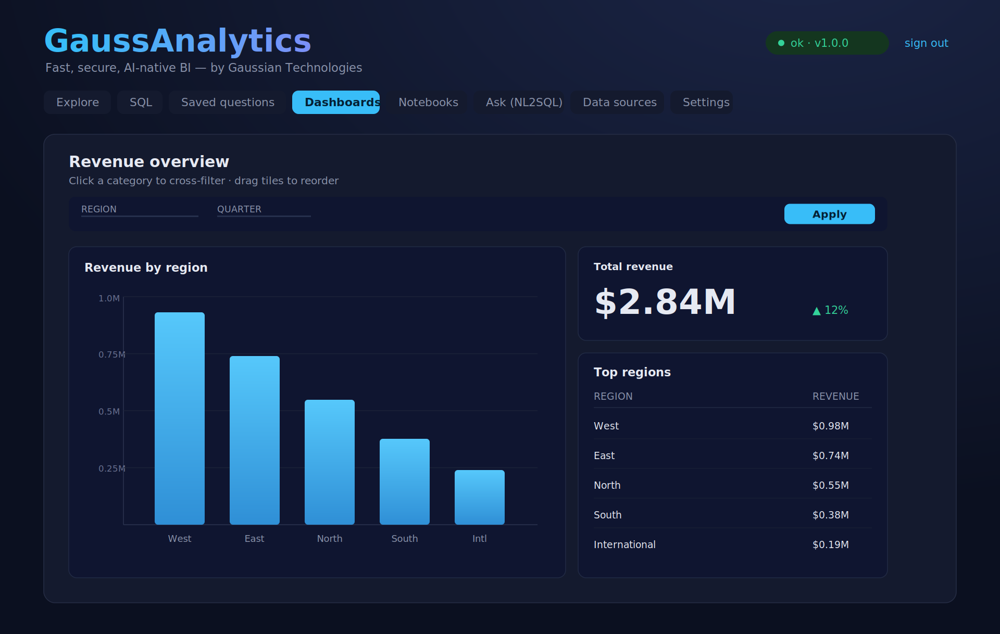
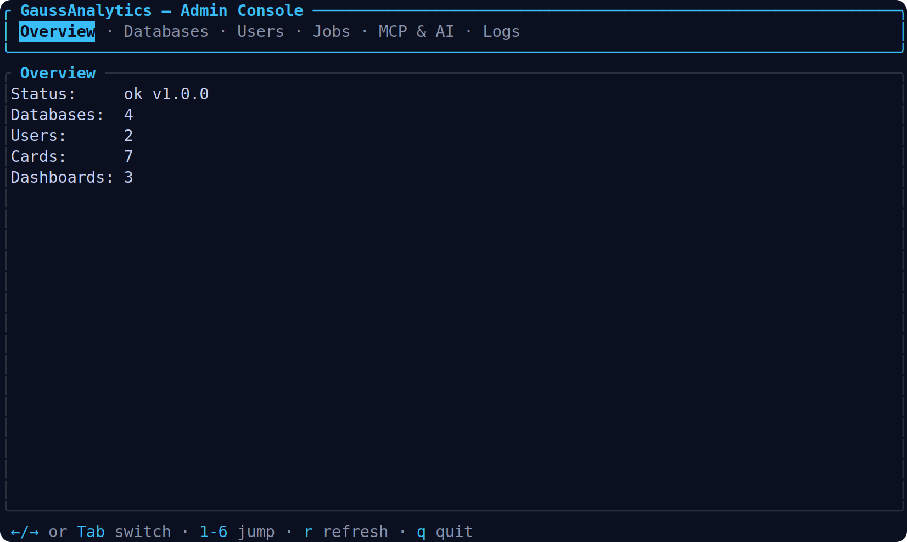

<div align="center">

# GaussAnalytics

**The fast, secure, AI-native BI platform — built in Rust.**

_by [Gaussian Technologies](https://gaussian.tech)_

Connect a database, ask in plain English or point-and-click, ship a dashboard.
No GC pauses. No string-built SQL. No black-box AI.

**v1.0** — the BI loop is end-to-end and the data-source layer is
production-grade: pooled live connections, masked credentials, and seven
engines behind one driver/dialect abstraction.

[Quickstart](#quickstart) · [Architecture](docs/ARCHITECTURE.md) ·
[Comparison](docs/COMPARISON.md) · [Roadmap](docs/ROADMAP.md) ·
[Strategy](docs/STRATEGY.md)

<br/>



<sub>The React web app — explore, dashboard, and share. Below: the keyboard-driven operator console (`gaussctl admin`), rendered from the live widget tree.</sub>



</div>

---

## Why it's different

- ⚡ **Rust core.** A native, async query engine — predictable latency, fast cold
  starts, a fraction of the memory of JVM-based BI. Ships as a single static binary.
- 🔒 **Secure by construction.** Queries are *compiled*, never concatenated: every
  user value is a bound parameter, so SQL injection is structurally impossible —
  on every engine. Memory-safe Rust removes whole bug classes.
- 🤖 **AI-native, in-house, governed.** Natural-language → SQL runs *in-process*
  (no external service, no credential leak) through a self-correcting pipeline:
  schema-linking → few-shot → AST guardrails → execution-guided repair → PII
  redaction. Results come back with auto-charts, summaries, and follow-ups.
- 🖥️ **Operator-first.** A polished React web app **and** a fast, keyboard-driven
  terminal console — for the people who use BI and the people who run it.

## Quickstart

> **Prereqs:** [Rust](https://rustup.rs) 1.90+ · Node 20+ with `pnpm` (for the web UI).

```bash
cargo build --release
./target/release/gaussctl serve        # API + web UI → http://127.0.0.1:3000
./target/release/gaussctl admin        # operator TUI
```

```bash
curl localhost:3000/api/health
# structured query → safe, parameterized SQL (no value ever becomes SQL text):
curl -s -X POST localhost:3000/api/dataset/compile -H 'content-type: application/json' \
  -d '{"database_id":"<id>","query":{"source_table":"orders",
       "aggregations":[{"func":"sum","field":"total","alias":"revenue"}],"breakouts":["status"]}}'
```

Want the chat experience? `cargo run -p gauss-chat` (self-contained web UI, SSE
streaming, CSV upload) or `cargo run -p gauss-chat-tui` (terminal). Both default
to an offline mock LLM and a seeded demo DB — zero credentials to try it.

## Architecture

```
React web UI ─┐                      ┌─ gauss-query   GQL → parameterized SQL (per-dialect)
Operator TUI ─┼─► gauss-server ──────┼─ gauss-db      metadata store · RBAC · RLS
              │   (Rust / axum)      ├─ gauss-drivers SQLite·Postgres·MySQL·Oracle·Snowflake·…
              │                      ├─ gauss-nl2sql  in-process NL2SQL + guardrails
Chat (SSE) ───┴─► gauss-chat ────────┴─ gauss-engine·llm·sql·insight  (self-correcting agent)
```

- **GQL** — a structured query AST the UI builds and the compiler turns into
  parameterized SQL, with per-engine identifier quoting, placeholders, and paging.
- **GenBI result intelligence** — every result ships a recommended chart
  (deterministic Vega-Lite, no extra LLM call), a figures-from-the-rows summary,
  and grounded follow-up questions. Charts render via [nivo](https://nivo.rocks).
- **Governed AI** — generated SQL is schema-grounded, read-only-validated,
  permission-checked, PII-redacted, and audited. AI settings are editable at
  runtime and hot-swap the pipeline with no restart.

## Connectors & models

**Data sources** (one `Driver` trait, one per-engine `Dialect`): SQLite,
PostgreSQL, MySQL, **Oracle** (ORDS), **Snowflake**, BigQuery, ClickHouse. Add,
**test**, sync, and delete them from the web app's *Data sources* page or the
TUI. Live connections are **pooled and reused** across requests (bounded pools +
acquire timeouts), and connection-string **credentials are masked** in every API
response — the full URI never leaves the server.

**LLM providers** (the *Settings* page; runtime-editable + persisted): OpenAI,
Anthropic, Gemini, Ollama, **OpenRouter**, **LiteLLM**, **vLLM**, **Bedrock**
(via an OpenAI-compatible gateway), and an offline `mock`.

## Capabilities

Connect → explore/ask → save → dashboard → share → alert → export — the full
BI loop, plus natural language on top:

- Structured query builder **+** native SQL **+** NL2SQL ("Ask")
- Saved questions, collections, reusable metrics
- Dashboards: filters/parameters, layout, tabs, **Markdown text cards**,
  click-to-cross-filter, auto-refresh, dashboard links
- Permissions, **row-level security**, signed-token embedding, content export/import
- Background scheduler with query **alerts** and **emailed subscriptions**
- Interactive charts (bar/line/area/scatter/funnel/combo/pie) via nivo/D3
- **Embedded notebooks**: Markdown · Python · SQL/NL2SQL (→ pandas DataFrame) ·
  Input · nivo **charts** & **big numbers**, with a reactive dependency DAG
  (run-in-order, re-run-dependents), **publish any cell onto a dashboard**
  (snapshot-rendered, schedule-refreshed), **`.ipynb` import/export**, and a
  governed in-notebook **AI assistant** — on your local (or a managed sandboxed)
  Jupyter kernel; opt in with `GAUSS_JUPYTER_ENABLED`
  ([plan](docs/NOTEBOOKS_PLAN.md))

See [docs/COMPARISON.md](docs/COMPARISON.md) for an honest, feature-by-feature
comparison with the reference platform.

## Repo map

```
crates/
  gauss-core · gauss-query · gauss-config · gauss-auth · gauss-db · gauss-drivers
  gauss-scheduler · gauss-mcp-gateway · gauss-nl2sql · gauss-notebook · gauss-server · gauss-tui · gaussctl
  # NL2SQL engine:  gauss-engine · gauss-semantic · gauss-sqlguard · gauss-llm
  #                 gauss-sql · gauss-textsql · gauss-chart · gauss-insight
  #                 gauss-tools · gauss-embed · gauss-memory · gauss-runtime
  # chat UIs:       gauss-chat · gauss-chat-tui
frontend/   React + TypeScript (charts via nivo/D3)
docs/       architecture · comparison · strategy · roadmap · ADRs
```

## Development

```bash
cargo test --workspace      # Rust tests        pnpm -C frontend test    # web tests
cargo clippy --workspace    # lint              pnpm -C frontend build   # web build
cargo fmt --all             # format
```

Configuration is environment-driven (`GAUSS_*`); see [`.env.example`](.env.example).

## License

[MIT](LICENSE) © 2026 Gaussian Technologies.
